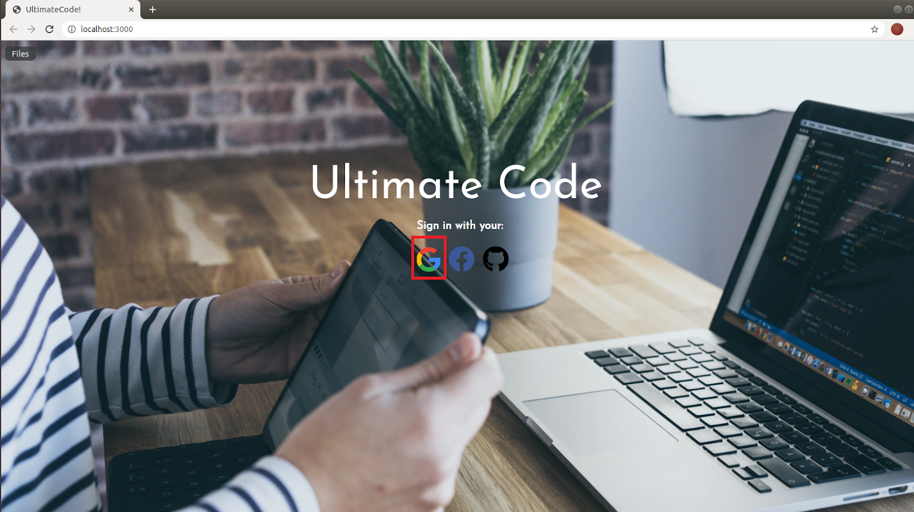
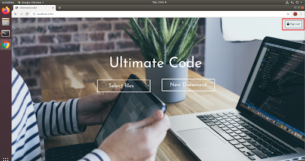
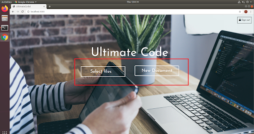
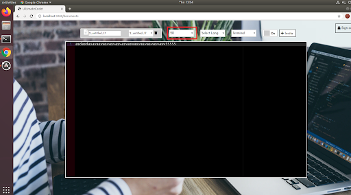
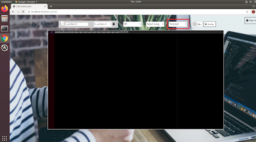
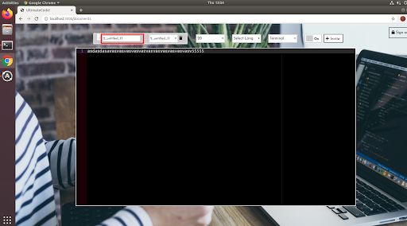

## How to run:

Go to the root directory of Ultimatecode and run `rails server`.

You may need to create your database (install postgres) to run the project in your local machine.

## Feature:

**sign-in/sign-out:**

Log in with your google account. (Facebook login and GitHub login not implemented)
Sign in with google account.

Sign-out button:

**create/save/load document:**

On the home page, you can choose to create a new document or load your old documents. Ultimatecode will save your document every time you make changes to it.

On the edit page, there is a drop-down list for you to select the document you want to change.

**delete document:**

Delete current document when users press the small garbage can icon. We will use an alert message to confirm the delete action.

**change font size:**

A drop-down list that allows you to change the font size of your documents.

**Display line number:**

A button to turn on/off the line number display feature.

**change theme(dark, light):**

A drop-down list that allows you to change the background theme of your documents.

**change file name:**

A text box that lets you change the file name of current document. We use onblur event to detect the end of input. We will check if the file name already exists and use an alert message to notify users that the file name already exists.

**syntax highlighting:**

A drop-down list that changes the highlighting of your documents depending on the language you select. Now, python, ruby, c/c++, Golang, java, and some often-used languages are supported.

**collaboration:**

Invite other collaborators with their email, and then start editing the same file.

  
  
  
  
  
  